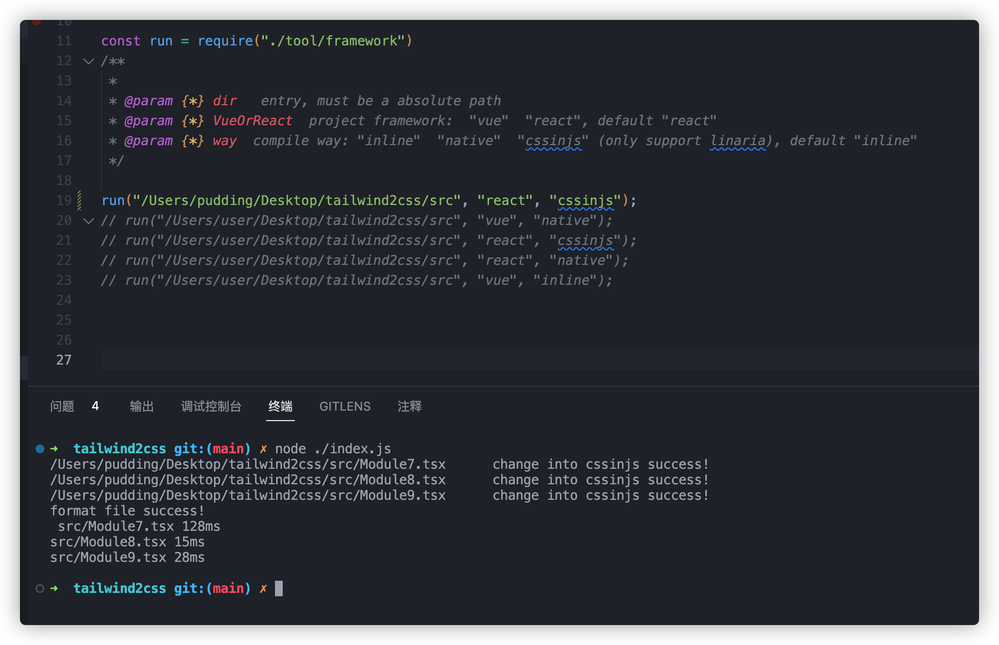
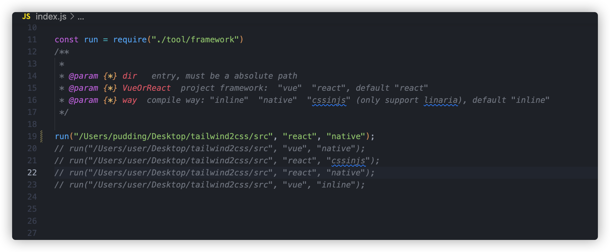
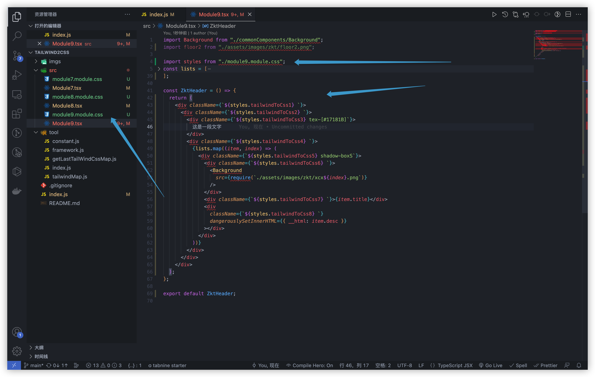

## Convert tailwindcss to css, convert tailwindcss to inline css, convert tailwindcss to native css, and enable one-click migration in Vue or React frameworks

Give a star ⭐ if this project helped you!

---

**[Try It Online](https://puddingjoker.github.io/tailwindcss2cssonline/)**

---

### Execution Steps:
###### Step 1: `npm install -g prettier`

 <b>  run with native classname  </b>

 <b>  run linaria cssinjs transform in react/vue framework  </b>

 <b>  run inline transform in react/vue framework  </b>

 <b>  run native transform in react/vue framework  </b>

