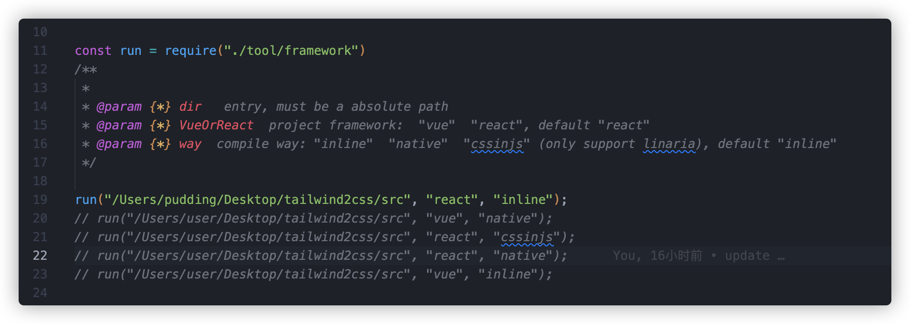
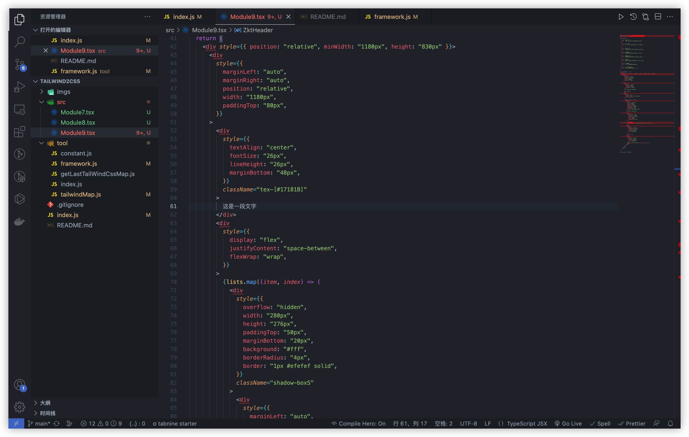

# TailwindCss To Css、TailwindCss To CssInJs、TailwindCss To InlineCss, One-Click Conversion In Vue or React Framework

Convert tailwindcss class to css or to inline-style or to linaria cssinjs

#### try it online! [PuddingJoker/tailwindcss2css](https://puddingjoker.github.io/tailwindcss2cssonline/)

 <b>  run with native classname  </b>

 <b>  run linaria cssinjs transform in react/vue framework  </b>

 <b>  run inline transform in react/vue framework  </b>

 <b>  run native transform in react/vue framework  </b>

#### Give a star if this project helped you~
