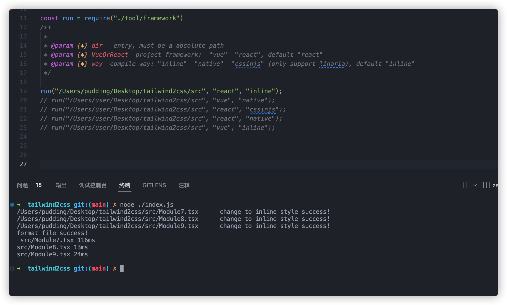

# TailwindCss To Css、TailwindCss To CssInJs、TailwindCss To InlineCss, One-Click Conversion In Vue or React Framework

Convert tailwindcss class to css or to inline-style or to linaria cssinjs

 <b>  run with pure classname  </b>

 <b>  run linaria cssinjs transform in react/vue framework  </b>

 <b>  run inline transform in react/vue framework  </b>

Give a star if this project helped you~
